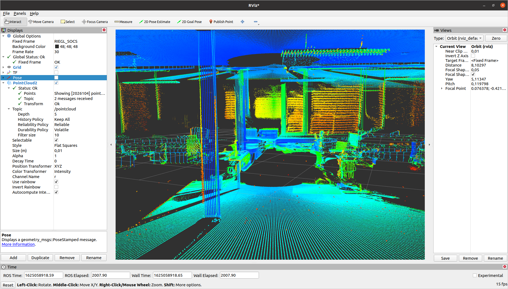

# ROS 2 RIEGL-VZ Package

This ROS package is based on ROS 2 Galactic Geochelone and has been tested on Ubuntu Desktop 20.04 (Focal Fossa).

**Install python requirements:**

```python3 -m pip install -r requirements.txt```

**Install librdb python wheel:**

```pip3 install librdb/riegl.rdb-2.3.4-cp34.cp35.cp36.cp37.cp38.cp39-none-linux_x86_64.whl```

**Build package:**

Switch to workspace root directory.

```colcon build```

**Start 'riegl_vz' node:**

Open a second terminal. Execute '. install/setup_bash.sh'.

Find .yaml files for configuration of node parameters in package install directory at: **install/riegl_vz/share/riegl_vz/config/**.

Copy **params_default.yaml** to **params.yaml** end edit parameter settings.

Launch 'riegl_vz' node with parameter settings from params.yaml:

```ros2 launch riegl_vz riegl_vz std_launch.py```

**Trigger a scan data acquisition:**

Open another terminal. Execute '. install/setup_bash.sh'.

Execute the scan trigger service:

```ros2 service call /scan std_srvs/srv/Trigger```

Visualize scan data point cloud with rviz:

Start rviz tool:

```rviz2```

Set fixed-frame to 'RIEGL_SOCS' and bind to riegl_vz/pointcloud topic:


