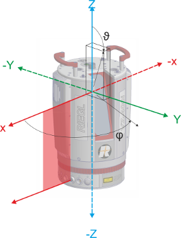

# RIEGL-VZi ROS 2 Driver API

## 1. Coordinate Systems

RIEGL uses hierarchically structured coordinate systems:

**SOCS** (Scanner's Own Coordinate System): Angle data and range data are the base for calculation of the data in the Scanner’s Own Coordinate System (SOCS).




**PRCS** (Project Coordinate System): A number of scan positions and the data acquired therein make up a scan project.The center of the project’s coordinate system (PRCS) usually coincides horizontally with the center of the first scan position. The axes of PRCS are strictly pointing to east (x-axis, red), north (y-axis, green) and up (z-axis, blue), respectively.


**VOCS** (Voxel Coordinate System): This is an intermediate coordinate system. Origin and orientation are identical to PRCS at the first scan position. Each scan will be registered in the VOCS coordinate system.
* Every scan position is described by SOPV (Scan Orienqtation and Position in VOCS).
* The position of the VOCS is described by VOP (VOCS Orientation and Position in PRCS).
* With every scan the VOP, especially the orientation, will be readjusted.
* The SOP (Scan Position and Orientation in PRCS) has to be recalculated after each newly registered scan from SOPV and updated VOP.

```
                SOCS ---           
                 |      |
                sopv    |
                 |      |
                VOCS   sop
                 |      |
                vop     |
                 |      |
                PRCS ---
```

## 2. RIEGL Interfaces

### 2.1 Messages

**riegl_vzi_interfaces/Status**:

```
uint8 errors
uint8 warnings
uint8 scan_progress
uint8 memory_usage
```
tbd...

### 2.2 Services

**riegl_vzi_interfaces/GetPointcloud**:
```
uint32 n
---
PointCloud2 pointcloud
```
See PointCoud2 definition: [sensor_msgs/PointCloud2](https://docs.ros.org/en/api/sensor_msgs/html/msg/PointCloud2.html)

**riegl_vzi_interfaces/GetPose**:
```
int32 first
int32 last
---
PoseStamped vop
PoseStamped sopv[]
PoseStamped sop[]
```
A negative value of n/first/last points to the last scan position. 0 ist the first scan position.

See PoseStamped definition: [sensor_msgs/PoseStamped](http://docs.ros.org/en/api/geometry_msgs/html/msg/PoseStamped.html)[]

## 3. Nodes

### 3.1 riegl_vz

#### 3.1.1 Parameters

**~hostname** (string, default: "") :

The scanners hostname or IP address.

**~ssh_user** (string, default: "user") :

The linux user name for SSH login on the scanner.

**~ssh_password** (string, default: "user") :

The linux user password for SSH login on the scanner.

**~scan_pattern** (string, default: "Overview") :

The scan pattern for laser scanning, specifying the field of view (FOV) and the delta angles between laser shots on line and frame angle.

**~meas_prog** (integer, default: 0) :

The laser scanners measurement program, defining the laser pulse repetition rate (PRR).

**~stor_media** (integer, default: 2) :

Automatically increment scan position before every data acquisition start.

**~coarse_registration** (bool, default: False) :

Enable coarse registration. If coarse registration fails, the standard registration method will be applied.

**~pointcloud_msm** (integer[],  default: {1,1}) :

The point cloud MSM (monitor step multiplier) configuration, used for scan data reduction, default disabled ([0]: lines, [1]: shots).


#### 3.1.2 Published Topics

**pointcloud** ([sensor_msgs/PointCloud2](https://docs.ros.org/en/api/sensor_msgs/html/msg/PointCloud2.html)) :

Point cloud with scan data from the laser scanner in SOCS.

**status** (riegl_vzi_interfaces/Status) :

Riegl VZ scanner status, provided once per second.


#### 3.1.3 Services

**create_project** ([std_srvs/Trigger](http://docs.ros.org/en/api/std_srvs/html/srv/Trigger.html)) :

Create a new or load an existing project on the scanner with name composed from current local time (date and time).

Returns:  
success = True -> message: Project Name  
success = False -> message: Error Message  

**scan** ([std_srvs/Trigger](http://docs.ros.org/en/api/std_srvs/html/srv/Trigger.html)) :

Acquire laser scan data. Start scan and wait until finished. When the scan has finished data is published on 'pointcloud' topic.

Returns:  
success = True -> message: Measurement Identifier  
success = False -> message: Error Message  

**get_pointcloud** (riegl_vzi_interfaces/GetPointcloud) :

Get point cloud data of a previously acquired scan position.

**scan_register** ([std_srvs/Trigger](http://docs.ros.org/en/api/std_srvs/html/srv/Trigger.html)) :

Start laser scan registration in actual project and wait until finished. Provide estimated position on 'pose' topic.

Returns:  
success = True -> message: SUCCESS  
success = False -> message: Error Message  

**get_pose** (riegl_vzi_interfaces/GetPose) :

Request VOP, SOPV and SOP for scan position(s).

**shutdown** ([std_srvs/Trigger](http://docs.ros.org/en/api/std_srvs/html/srv/Trigger.html)) :

Shutdown the laser scanner.

Returns:  
success = True -> message: SUCCESS  
success = False -> message: Error Message  
